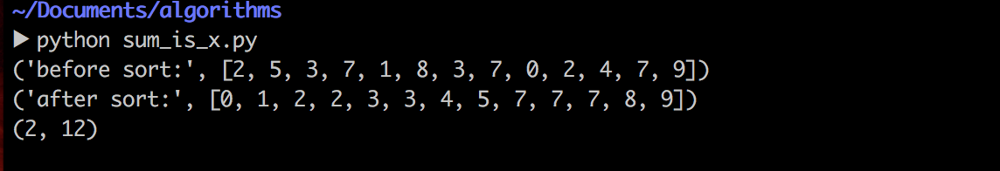
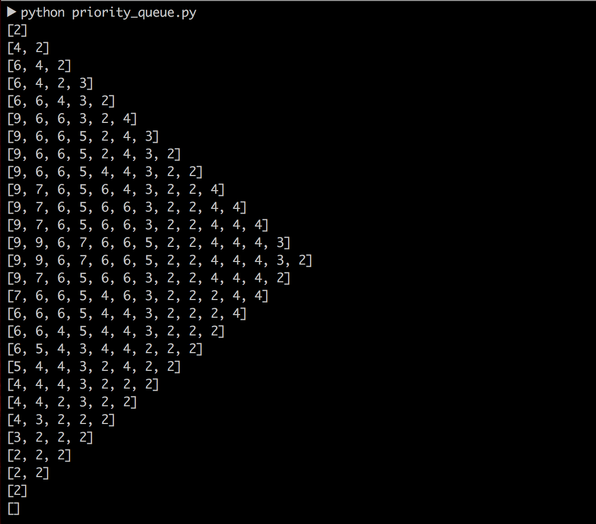
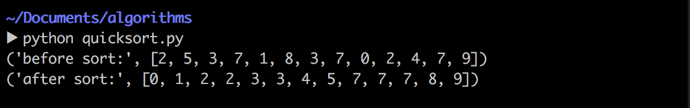
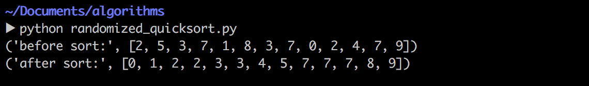
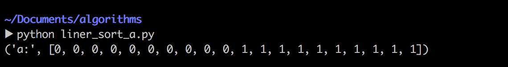
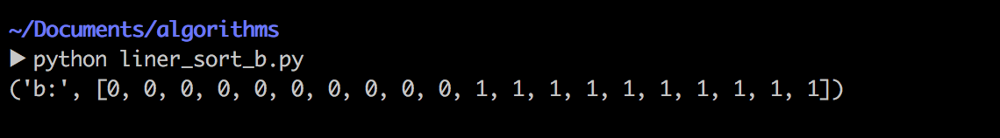
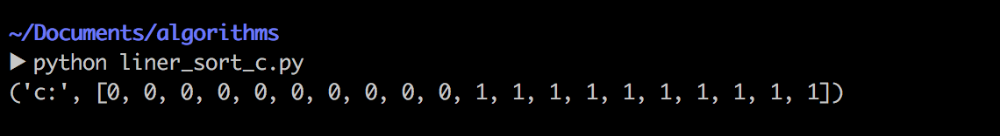
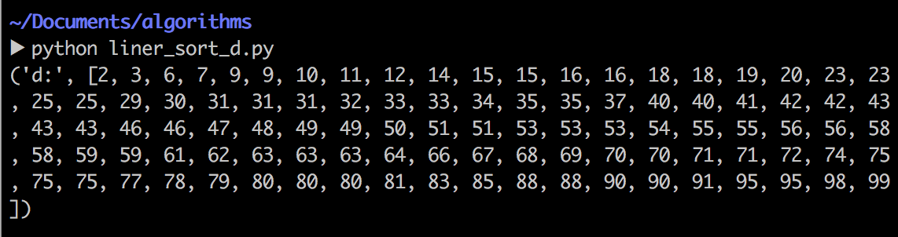
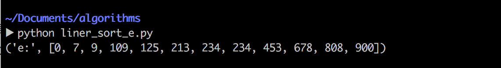

##算法设计与分析第一次上机报告
>Author：康赣鹏
>
>StudentID：14130140377
>
>Email：1159838847@qq.com
>
>Teacher：覃桂敏

* Assignment：realize the  given problems.
* note: The code listed in the passage is python.Python version:Python 2.7.10

###Problem 1
* 1.1 Problem Description:
	* Describe a Θ(n lg n)-time algorithm that, given a set S of n integers and another integer x, determines whether or not there exist two elements in S whose sum is exactly x. (Implement exercise 2.3-7.)
* 1.2 How to solve it?
	* Firstly,the set S of n integers can be an array named S.Array S is sorted with QUICKSORT.
	* Secondly,there is an array {Xk | Xk = Si + Sj , 1 < i < n , 1 < j < n , 0 < k < 2n}.We can select the first number S1(the smallest number of Array S) and the last number Sn(the largest number of Array S) from Array S.At this time,S1 + Sn is the middle number of Array X.
	* At last,Let's delive an example.We can compare the x with S1 + Sn.If x > S1 + Sn,we are supposed to compare x with S2 + Sn.If x < S1 + Sn,we are supposed to compare x with S1 + Sn-1.If x == S1 + Sn,problem solved. 
	* Code lists:
	
			def sum(numlist,x):
    			right = 0
    			left = len(numlist) - 1
    			while right < left:
        			if numlist[right] + numlist[left] == x:
            			return (right,left)
        			elif numlist[right] + numlist[left] < x:
            			right = right + 1
        			else:
            			left = left - 1
    			return False
			print(sum(s,11))
			
			
* 1.3 Result:
	*  Array S [2, 5, 3, 7, 1, 8, 3, 7, 0, 2, 4, 7, 9]
	*  To find the Si + Sj which is equal to x.(x = 11)
	*  
	*  We got the sorted Array S [0, 1, 2, 2, 3, 3, 4, 5, 7, 7, 7, 8, 9].And we got the result ------ S2 + S12 which is equal to x.(x = 11)

###Problem 2
* 2.1 Problem Description:
	*	Implement priority queue.
* 2.2 How to solve it?
	*  I built two class ------ PRIORITY_QUEUE and MaxHeap.MaxHeap stores orignal data with a data structure ------ Heap.The basic architecture:
				
			class MaxHeap:
    			def __init__(self,item=[]):
         	   	 	......
         	    def PARENT(self,i):
					......
				def LEFT(self,i):
        			......
    			def RIGHT(self,i):
        			......
    			def MAX_HEAPIFY(self,i):
 					......
    			def BUILD_MAX_HEAP(self):
					......
    			def HEAP_EXTRACT_MAX(self):
					......
    			def MAX_HEAP_INSERT(self,key):
					......
    			def SHOW(self):
        			......
        		
        		
	*  PRIORITY_QUEUE.The basic architecture:
	
			class PRIORITY_QUEUE(MaxHeap):
    			def __init__(self,item = []):
       				......
    			def EnQueue(self,key):
       				......
    			def DeQueue(self):
       				......

	*  	Code lists:
	
    
    		def MAX_HEAPIFY(self,i):
        		l = self.LEFT(i)
        		r = self.RIGHT(i)
        		if l < self.HeapLength and self.items[l] > self.items[i]:
            		largest = l
        		else:
            		largest = i

        		if r < self.HeapLength and self.items[r] > self.items[largest]:
            		largest = r

        		if largest != i:
            		self.items[i],self.items[largest] = self.items[largest],self.items[i]
            		self.MAX_HEAPIFY(largest)

    			
    		def BUILD_MAX_HEAP(self):
        		i = self.PARENT(len(self.items)-1)
        		while i >= 0:
            		self.MAX_HEAPIFY(i)
            		i = i - 1

    		def HEAP_EXTRACT_MAX(self):
        		temp = len(self.items) - 1
        		if temp < 0:
            		return False
        		else:
            		self.items[0],self.items[temp] = self.items[temp],self.items[0]
            		val = self.items.pop()
            		self.HeapLength -= 1
            		self.MAX_HEAPIFY(0)
            		return val

   			def MAX_HEAP_INSERT(self,key):
        		self.items.append(key)
        		i = len(self.items) - 1
        		parId = self.PARENT(i)
        		while i >= 0 and self.items[parId] < self.items[i]:
            		self.items[parId],self.items[i] = self.items[i],self.items[parId]
            		i = parId
            		parId = self.PARENT(parId)
        		self.HeapLength = self.HeapLength + 1
* 2.3 Result:
	*  Here is the process that how the Heap is built.The max heap is extracted from the Heap one by one.Finally,we can get the sorted Array.
	*  

###Problem 3

* 3.1 Problem Description:
	*	Implement Quicksort and Randomized Quicksort. Answer the following questions. 
	* (1) How many comparisons will Quicksort do on a list of n elements that all have the same value? 
	* (2) What are the maximum and minimum number of comparisons will Quicksort do on a list of n elements, give an instance for maximum and minimum case respectively. 

* 3.2 How to solve it?
	* Question one:
		* There are n^2 comparisons will Quicksort do on the list of n elements that all have the same value.
	* Question two:
		*  The maximum number of comparsions will be n^2 and the minimum number of comparsions will be nlogn
	
	* The basic architecture: 
	* Mainly consisted of two function:
		
			#QUICKSORT
			def PARTITION(numlist,left,right):
				......
			def QUICKSORT(numlist,left,right):
				......
			
			#RAMDOMIZED_QUICKSORT
			def RANDOMIZED_PARTITION(numlist,left,right):
				......
			def RANDOMIZED_QUICKSORT(numlist,left,right):
				......
	
	* Code lists:

			#QUICKSORT
			def PARTITION(numlist,left,right):
    			flag = numlist[right]
    			i = left - 1
    			for j in range(left,right):
        			if numlist[j] <= flag:
            		i = i + 1
            		numlist[i],numlist[j]=numlist[j],numlist[i]
    				numlist[right],numlist[i+1]=numlist[i+1],numlist[right]
    			return i+1

			def QUICKSORT(numlist,left,right):
   				if left < right:
        		middle = PARTITION(numlist,left,right)
        		QUICKSORT(numlist,left,middle-1)
        		QUICKSORT(numlist,middle+1,right)
    			return numlist
    			
    		#RAMDOMIZED_QUICKSORT
    		def RANDOMIZED_PARTITION(numlist,left,right):
    			templeft = left
    			tempright = right
    			i = random.randint(templeft,tempright)
  				tmp = numlist[i]
    			numlist[i] = numlist[right]
    			numlist[right] = tmp

    			return PARTITION(numlist,left,right)

			def RANDOMIZED_QUICKSORT(numlist,left,right):
    			if left < right:
        		middle = RANDOMIZED_PARTITION(numlist,left,right)
        		RANDOMIZED_QUICKSORT(numlist,left,middle-1)
        		RANDOMIZED_QUICKSORT(numlist,middle+1,right)
    			return numlist

* 3.3 Result:
	*  QUICKSORT
	*  
	*  RAMDOMIZED_QUICKSORT
	*  

###Problem 4

* 4.1 Problem Description:
	* 
Sorting in place in linear time
Suppose that we have an array of n data records to sort and that the key of each record has the value 0 or 1. An algorithm for sorting such a set of records might possess some subset of the following three desirable characteristics:
		1. The algorithm runs in O(n) time.
		2. The algorithm is stable.
		3. The algorithm sorts in place, using no more than a constant amount of storage space in addition to the original array.

	* a. Give an algorithm that satisfies criteria 1 and 2 above.
	* b. Give an algorithm that satisfies criteria 1 and 3 above.
	* c. Give an algorithm that satisfies criteria 2 and 3 above.
	* d. Can you use any of your sorting algorithms from parts (a)–(c) as the sorting method used in line 2 of RADIX-SORT, so that RADIX-SORT sorts n records with b-bit keys in O(bn) time? Explain how or why not.
	* e. Suppose that the n records have keys in the range from 1 to k. Show how to modify counting sort so that it sorts the records in place in O(n+k) time. You may use O(k) storage outside the input array. Is your algorithm stable? (Hint: How would you do it for k = 3?)

* 4.2 How to solve it?
	* a. COUNTING SORT ,which is stable and runs in O(n) time, can satisfy criteria 1 and criteria 2 above.
		* code lists: 
						
				def COUNTING_SORT(A,B,k):
    			c = []

    			for i in range(0,k+1):
        			c.append(0)
    			for j in range(0,len(A)):
        			c[A[j]] = c[A[j]] + 1
    			for j in range(1,k+1):
        			c[j] = c[j] + c[j-1]
    			for j in range(len(A)-1,-1,-1):
        			B[c[A[j]]-1] = A[j]
        			c[A[j]] = c[A[j]]-1
    			return B
	* b. Basic design:The array is consisted of 0 or 1.Based on this characteristic, i made two pointers.The first pointer  named  is pointed to the first number.The second pointer named right is pointed to the last number.The first pointer should be on the left of the second pointer.If the number pointed by left is smaller than the number pointed by right,left moves forward for one step and right moves back for one step.If the number pointed by left is bigger than the number pointed by right,swap the two numbers,left moves forward for one step and right moves back for one step.If the number pointed by left is equal to the number pointed by right,there are two cases.In case of the number pointed by left being 1,right should be moved back for one step.In case of the number pointed by right being 0,left should be moved forward for one step.At last ,we can get the sorted array.
		* code lists:
		
				def liner_sort(numlist):
    				left = 0
    				right = len(numlist) - 1
    				while left < right:
       	 				if numlist[left] <  numlist[right]:
            				left += 1
            				right -= 1
        				if numlist[left] > numlist[right]:
            				numlist[left],numlist[right] = numlist[right],numlist[left]
            				left += 1
            				right -= 1
        				if numlist[left] == numlist[right]:
            				if numlist[left] == 1:
                				right -= 1
            				elif numlist[right] == 0:
                				left += 1
    				return numlist
	* c. MERGE SORT ,which is stable and sorts in place, can satisfy criteria 2 and criteria 3 above.
 		* code lists:
 		
 				def merge(a, b):
    				c = []
    				h = j = 0
    				while j < len(a) and h < len(b):
        				if a[j] < b[h]:
            				c.append(a[j])
            				j += 1
        				else:
            				c.append(b[h])
            				h += 1
    				if j == len(a):
        				for i in b[h:]:
            				c.append(i)
    				else:
        				for i in a[j:]:
            				c.append(i)
    				return c

				def merge_sort(numlist):
    				if len(numlist) <= 1:
        				return numlist
    				middle = len(numlist)/2
    				left = merge_sort(numlist[:middle])
    				right = merge_sort(numlist[middle:])
    				return merge(left, right)

	* d. RADIX SORT 
		* code lists:
	
				import random
				def RADIX_SORT():
    				A = [random.randint(1,99) for i in xrange(100)]
    				for k in xrange(2):
        				s = [[]for i in xrange(10)]
        			for i in A:
            			s[i/(10**k)%10].append(i)
        			A = [a for b in s for a in b]
    				return A

 	* e. inplace COUNTING SORT : I made a new array named c_save which stores the same number as array c.When the sorting step came,we are supposed to judge whether it satisfies the condition(i>c[A[i]]-1 and i<=c_save[A[i]]-1) or not.With the judgement,we can save a lot of spaces which is the same as Array A.
 		* code lists:
 		
 				def INPLACE_COUNTING_SORT(A,k):
    				c =[]
    				c_save = []
    				n = len(A)
    				for i in range(0,k+1):
        				c.append(0)
        				c_save.append(0)
    				for j in range(0,n):
        				c[A[j]] += 1
        				c_save[A[j]] += 1
    				for j in range(1,k+1):
        				c[j] = c[j] + c[j-1]
        				c_save[j] = c_save[j] + c_save[j-1]

    				i = n-1
    				while i >=0:
        				if i>c[A[i]]-1 and i<=c_save[A[i]]-1:
            				i = i - 1
        				else:
            				c[A[i]] = c[A[i]] - 1
            				A[c[A[i]]-1],A[i] = A[i],A[c[A[i]]-1]

    				return A
 * 4.3 Result:
	*  a.COUNTING SORT
	*  
	*  b.LINER SORT 
	*  
	*  c. MERGE SORT
	*  
	*  d.RADIX SORT
	*  
	*  e. inplace COUNTING SORT 
	*  
