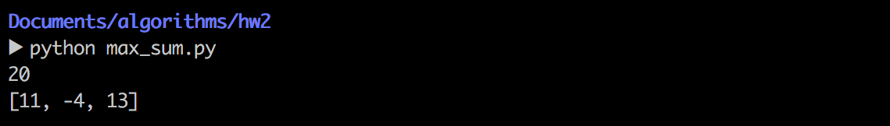

算法设计与分析第二次上机报告

           
                  

Author：康赣鹏

StudentID：14130140377

Email：1159838847@qq.com

Teacher：覃桂敏

* Assignment：realize the  given problems.
* note: The code listed in the passage is python.Python version:Python 2.7.10

###Problem 1
* 1.1 Problem Description:
	* Matrix-chain product. The following are some instances
	* <3, 5, 2, 1,10>
	* <2, 7, 3, 6, 10>
	* <10, 3, 15, 12, 7, 2>
	* <7, 2, 4, 15, 20, 5>
* 1.2 How to solve it?
 * I soloved this problem with Dynamic Programming.There are two strategy:from top to down and from down to top.
 * The dynamic programming formula:
 
 			m[i,j] = 0,when i = j;
 			m[i,j] = min{m[i,k]+m[k+1,j]+Pi-1*Pk*Pj,when i < j;
 
 * form top to down:i use the recursive strategy.
 * from down to top:i use two two-dimension array to store the 'k',by which the optimal substructure can be represented.
 	
 * Code lists 1(recursive,top-down):
 
 			def recursive_matrix_chain(p,i,j):
    			if i == j:
        			return 0
    			for k in range(i,j):
        			q = recursive_matrix_chain(p,i,k)+recursive_matrix_chain(p,k+1,j)+p[i-1]*p[k]*p[j]
        			if q<m[i][j]:
            			m[i][j] = q
            			s[i][j] = k
    			return m[i][j] 
  
 * Code lists 2(down-top):
 
 			def matrix_chain(p):
    			n = len(p) - 1
    			m = [[0]*(n+1) for i in range(n+1)]
    			s = [[0]*(n+1) for i in range(n+1)]
    			for l in range(2,n+1):
        			for i in range(1,n-l+2):
            			j = i + l - 1
            			m[i][j] = sys.maxint
           			for k in range(i,j):
                			q = m[i][k]+m[k+1][j]+p[i-1]*p[k]*p[j]
                			if q < m[i][j]:
                    		m[i][j] = q
                    		s[i][j] = k
    			return m,s
    			
    		def print_optimal_parens(s,i,j):
    			if i == j:
        			print 'A%d'%(i),
    			else:
        			print '(',
        			print_optimal_parens(s,i,s[i][j])
        			print_optimal_parens(s,s[i][j]+1,j)
        			print ')',

* 1.3 Result:
	* 

###Problem 2
* 2.1 Problem Description:
	* Longest Common Subsequence (LCS). The following are some instances.
	* X: xzyzzyx   
	* Y: zxyyzxz
	* X: ALLAAQANKESSSESFISRLLAIVAD            
	* Y: KLQKKLAETEKRCTLLAAQANKENSNESFISRLLAIVAG
* 2.2 How to solve it?
	* I soloved this problem with Dynamic Programming.There are two strategy:from top to down and from down to top.
 	* The dynamic programming formula:
 				
 			c[i,j] = 0,when i = 0 or j = 0;
 			c[i,j] = c[i-1,j-1]+1,when i,j>0 and xi = yj
 			c[i,j] = max(c[i,j-1],c[i-1,j],when i,j>0 and xi != yj

	*  	Code lists 1(recursive,top-down):

			def RECURSIVE_LCS(x,y):
    			if (len(x) == 0 or len(y) == 0):
        			return 0
    			else:
        			a = x[0]
        			b = y[0]
        			if (a == b):
            			listc.append(a)
            			return RECURSIVE_LCS(x[1:],y[1:]) + 1
        			else:
            			return MAX_SE(RECURSIVE_LCS(x[1:],y),RECURSIVE_LCS(x,y[1:]))

			def MAX_SE(a,b):
    			if(a >= b):
        			return a
    			else:
        			return b
        			
    * Code list 2(down-top):
     
     		def lcs_len(a, b):
    			n = len(a)
    			m = len(b)

    			l = [([0] * (m + 1)) for i in range(n + 1)]
    			direct = [([0] * m) for i in range(n)]

    			for i in range(n + 1)[1:]:
        			for j in range(m + 1)[1:]:
            			if a[i - 1] == b[j - 1]:
                			l[i][j] = l[i - 1][j - 1] + 1
            			elif l[i][j - 1] > l[i - 1][j]:
                			l[i][j] = l[i][j - 1]
                			direct[i - 1][j - 1] = -1
            			else:
                			l[i][j] = l[i - 1][j]
                			direct[i - 1][j - 1] = 1

    			return l, direct
    			
    		def get_lcs(direct, a, i, j):
    			lcs = []
    			get_lcs_inner(direct, a, i, j, lcs)
    			return lcs

			def get_lcs_inner(direct, a, i, j, lcs):
    			if i < 0 or j < 0:
        			return

    			if direct[i][j] == 0:
        			get_lcs_inner(direct, a, i - 1, j - 1, lcs)
        			lcs.append(a[i])

    			elif direct[i][j] == 1:
        			get_lcs_inner(direct, a, i - 1, j, lcs)
    			else:
        			get_lcs_inner(direct, a, i, j - 1, lcs)

* 2.3 Result:
	*  from down to top:i can get the Longest Common Subsequence. 
	*  
	*  from top to down:i can get the longest number with the recursive method.
	*  

###Problem 3
 * 3.1 Problem Description:
 	* Max Sum. The following are some instances:
 	* (-2，11，-4，13，-5，-2)
 * 3.2 How to solve it?
 	* I use a temp number to store the largest currently number.With an easy loop and comparison,i can get max sum.This strategy is from down to top.
 	* Code list:
 	
 			def max_sum(p):
    			sum = p[0]
    			result = p[0]
    			start = 0
    			for i in range(1,len(p)-1):
        			if sum > 0:
            			sum += p[i]
        			else:
            			sum = p[i]
            			start = i
        			if sum > result:
            			result = sum
            			end = i
    			return result,start,end
    			
 
* 3.3 Result:
	*  
 	
###Problem 4
* 4.1 Problem Description:
	* Shortest path in multistage graphs. Find the shortest path from 0 to 15 for the following graph. A multistage graph is a graph 
	* (1) G=(V,E) with V partitioned into K >= 2 disjoint subsets such that if (a,b) is in E, then a is in Vi , and b is in Vi+1 for some subsets in the partition;  
	* (2) | V1 | = | VK | = 1.
	* 

* 4.2 How to solve it?
	* The strategy i used:from top to down ,recursive  
	* The dynamic programming formula:
		
			s[0,j] = 0 ,when j = 0;
			s[0,j] = s[0,k] + s[k,j],when j!=0
	* the data structure:
					
			graphs = {(0,1):(1,5),(0,2):(1,3),(1,3):(2,1),(1,4):(2,3),(1,5):(2,6),(2,4):(2,8),(2,5):(2,7),(2,6):(2,6),(3,7):(3,6),(3,8):(3,8),(4,7):(3,3),(4,8):(3,5),(5,8):(3,3),(5,9):(3,3),(6,8):(3,8),(6,9):(3,4),(7,10):(4,2),(7,11):(4,2),(8,11):(4,1),(8,12):(4,2),(9,11):(4,3),(9,12):(4,3),(10,13):(5,3),(10,14):(5,5),(11,13):(5,5),(11,14):(5,2),(12,13):(5,6),(12,14):(5,6),(13,15):(6,4),(14,15):(6,3)} 
	* code list(recursive,top-down):
	
			def RECURSIVE_SHORTEST_GRAPHS(graphs,j):
    			if j == 0:
    	    		return 0
    			m = sys.maxint
    			for k in range(j):
        			if (graphs.has_key((k,j))):
            			p = RECURSIVE_SHORTEST_GRAPHS(graphs,k)+graphs[(k,j)][1]
            		if p < m:
                		m = p
                		s[j] = (k,j)
    			return m

* 4.3 Result:
	*  

###Problem 5
 	 
* 5.1 Problem Description:
	* Longest Common Substring. The following are some instances.
	* X: xzyzzyx   
	* Y: zxyyzxz
	* X:MAEEEVAKLEKHLMLLRQEYVKLQKKLAETEKRCALLAAQANKESSSESFISRLLAIVAD               
	* Y:MAEEEVAKLEKHLMLLRQEYVKLQKKLAETEKRCTLLAAQANKENSNESFISRLLAIVAG
* 5.2 How to solve it?
	* The dynamic programming formula:
				
			m[i,j] = m[i-1,j-1] + 1,when i = j;
			m[i,j] = 0,when i != j;
	* code list 1(recursive,top-down)

			def RECURSIVE_LCStr(x,y):
    			if (len(x) == 0 or len(y) == 0):
        			return 0
    			else:
        			a = x[0]
        			b = y[0]
        			if (a == b):
            			return RECURSIVE_LCStr(x[1:],y[1:])+1
        			else:
            			return 0
    
   * code list 2(down-top)
   
   			def LCStr(a,b):
    			n = len(a)
    			m = len(b)

    			c = [([0] * (m + 1)) for i in range(n + 1)]
    			for i in range(n):
        			for j in range(m):
            			if (a[i] == b[j]):
                			c[i][j] = c[i-1][j-1] + 1
            			else:
                			c[i][j] = 0
    			return c

			def get_max(c):
    			coordinate = []
    			max = 0
    			for i in range(len(a)+1):
        			for j in range(len(b)+1):
            			if c[i][j] > max:
                			max = c[i][j]
            			else:
                			pass
    			for i in range(len(a)+1):
        			for j in range(len(b)+1):
            			if c[i][j] == max:
                			coordinate.append((i,j))
    			return max,coordinate

			def get_lss(c,a,x,max):
    			temp = []
    			while max > 0:
        			temp.append(a[x])
        			x -= 1
        			max -= 1
    			lss = temp[::-1]
    			return lss
* 5.3 Result:
	* from down to top:i can get most common string.
	* 
	* from top to down:i can get the largest common number with the recursive method.
	*  
	
	

