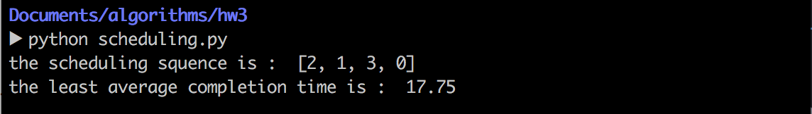

算法设计与分析第三次上机报告

           
                  

Author：康赣鹏

StudentID：14130140377

Email：1159838847@qq.com

Teacher：覃桂敏

* Assignment：realize the  given problems.
* note: The code listed in the passage is python.Python version:Python 2.7.10

###Problem 1
* 1.1 Problem Description:
	* 0-1 knapsack problem. 
	* Instance : weight capacity is 100

		item | weights | values
----|------|----
A | 50  | 200
B | 30  | 180
C | 45  | 225
D | 25  | 200
E | 5   | 50

* 1.2 How to solve it?
 * I soloved this problem with Dynamic Programming.
 *  The dynamic programming formula:
 
 			c[i,w] = 0,if i = 0or w =0
 			c[i,w] = c[i-1,w],if wi > w
 			c[i,w] = max{vi + c[i-1,w-wi],c[i-1,w]},if i > 0 and w >= wi
 * code list:
 
 			def knapsack(number,capacity,weight,values):
    			res=[[0 for j in range(capacity+1)] for i in range(number+1)]
    			for j in range(capacity+1):
        			res[0][j]=0
    			for i in range(1,number+1):
        			for j in range(1,capacity+1):
            			res[i][j]=res[i-1][j]
            			if j>=weight[i-1] and res[i][j]<res[i-1][j-weight[i-1]]+values[i-1]:
                			res[i][j]=res[i-1][j-weight[i-1]]+values[i-1]
    			return res

			def show(number,capacity,weight,res):
    			print 'the largest value:',res[number][capacity]
    			x=[False for i in range(number)]
    			j=capacity
    			for i in range(number,0,-1):
        			if res[i][j]>res[i-1][j]:
            			x[i-1]=True
            			j-=weight[i-1]
    			for i in range(number):
        			if x[i] == True:
            			print 'No ',i 
            			
* 1.3 Result:
* the largest value is 605.
* the chosed knapsacks is B,C and D.
	* 

	
###Problem 2
* 2.1 Problem Description:
	* Fractional knapsack problem 
	* Instance : weight capacity is 100

		item | weights | values
----|------|----
A | 50  | 200
B | 30  | 180
C | 45  | 225
D | 25  | 200
E | 5   | 50
* 2.2 How to solve it?
	* Based on Greedy strategy,i counted the average values of each knapsack.When i need to choose a knapsack,i will choose the one which possess the largest average values.
	* code list:
	* count the mean value 
	
			def MeanValues(weight,values,number):
    			res = [-1.0 for i in range(number)]
    			for i in range(number):
        			res[i] = values[i]/weight[i]
    			return res
 
   * extract the knapsack which possess the largest value
   
			def ExtractMax(mean,number):
    			Maxmean = max(mean)
    			for i in range(number):
        		if mean[i] == Maxmean:
            		temp = i
            		mean[i] = -1.0
    			return mean,temp

			def Fractinalknapsack(capacity,mean,number,weight,mostvalues):
   				while capacity > 0:
        			if max(mean) > 0:
            			mean,temp = ExtractMax(mean,number)
            		if capacity >= weight[temp]:
                		capacity -= weight[temp]
                		weight[temp] = 0
                		mostvalues += values[temp]
                		valueslist.append(temp)
            		elif capacity < weight[temp]:
                		i = weight[temp]
                		fractional = capacity/i
                		mostvalues += fractional*values[temp]
                		valueslist.append(temp)
                		capacity = 0
    			print valueslist
    			print "the last value's fraction :",fractional
    			print "the most values :",mostvalues
* 2.3 Result:
* the largest value is 630.
* the chosed knapsacks is D,C,A and B.B's fraction is 8/9
	* 
	
###Problem 3
 * 3.1 Problem Description:
 	* A simple scheduling problem. We are given jobs j1, j2… jn, all with known running time t1, t2… tn, respectively. We have a single processor. What is the best way to schedule these jobs in order to minimize the average completion time. Assume that it is a non-preemptive scheduling: once a job is started, it must run to completion. The following are some instances:
(j1, j2, j3, j4) : (15，8，3，10)
* 3.2 How to solve it?
	* Based on Greedy strategy.Everytime i scheduled the job,i will choose the least cost job.
	* key algorithms Code list: 
	* extract the least cost job
	
			def ExtractMin(jobs,num):
    			minint = min(jobs)
    			for i in range(len(jobs)):
        			if jobs[i] == minint:
            			temp = i
            		jobs[i] = sys.maxint
    				num -= 1
    			return temp,num,minint
    * schedule the jobs and count the time

			def scheduling(jobs,num,leasttime):
    			while num > 0:
        			temp,num,minint = ExtractMin(jobs,num)
        			sche.append(temp)
        			leasttime += minint*(num+1)
    			return num,leasttime
	
* 3.3 Result:
	* the scheduling sequence is : j3 j2 j4 j1
	* the least average completion time is:17.75 
	* 

	
###Problem 4
* 4.1 Problem Description:
	* Bin Packing: We have a number of bins each with a capacity of 1, and we have a set of objects all with different seizes, s1,s2,…,sn between 0 and 1. What is the fewest number of bins that would be needed to store all of the objects?
	* Instance: 0.5,0.7,0.3,0.9,0.6,0.8,0.1,0.4,0.2,0.5

* 4.2  How to solve it?
	* I used two point left and right.After the objects sequence was sorted,i let the left point to the first object and right point to the last object.The first object was the largest and the last object was the smallest.When i append the left object to the Bin,i will count the size and left + 1 .If the right object can be added into the Bin,append it.Else if the right object cannot be added into the Bin.I will new a Bin,then add the left object into it,and then judge whether the right object can be added into Bin or not.Until the left was bigger than right,the loop will not stopped.
	
	* Basic Greedy strategy:At first, i will select the largest object. Then,i will select the smallest object.
To fill the Bin with the objects as many as possible.

   * key algorithms Code list: 
   
   			while left < right :
    			if objects[left]+objects[right] + sum(Bin[Bincount]) <= 1:
        			Bin[Bincount].append(objects[left])
        			Bin[Bincount].append(objects[right])
        			left += 1
        			right -= 1
    			elif objects[left]+sum(Bin[Bincount]) <= 1:
        			Bin[Bincount].append(objects[left])
        			left += 1
    			elif objects[right]+sum(Bin[Bincount]) <= 1:
        			Bin[Bincount].append(objects[right])
        			right -= 1
    			else:
        			Bin.append([])
        			Bincount += 1
        			
* 4.3 Result:
	* There are 5 Bins.
	* The first Bin contain the objects with size 0.1 and 0.9.
	* The second Bin contain the objects with size 0.2 and 0.8.
	* The third Bin contain the objects with size 0.3 and 0.7.
	* The fourth Bin contain the objects with size 0.4 and 0.6.
	* The last Bin contain the objects with size 0.3 and 0.7.
 	* 