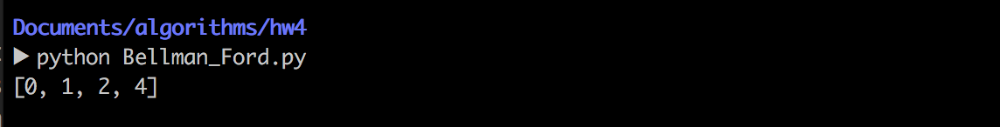
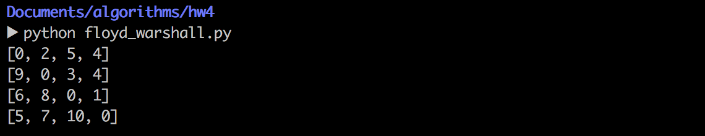
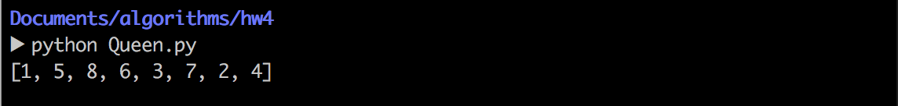
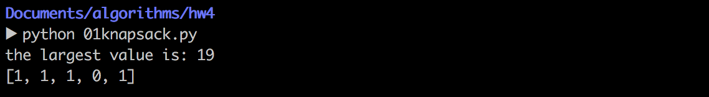

算法设计与分析第四次上机报告

           
                  

Author：康赣鹏

StudentID：14130140377

Email：1159838847@qq.com

Teacher：覃桂敏

* Assignment：realize the  given problems.
* note: The code listed in the passage is python.Python version:Python 2.7.10

###Problem 1
* 1.1 Problem Description:
	* Bellman-Ford algorithm  
* 1.2 How to solve it?
	* I stored a four nodes graph with lists 
	* data structure: 
				
			graph = [[0,1,3,6],
         			[1,0,1,5],
         			[3,1,0,2],
         			[6,5,2,0]] 
   * key algorithms list: 
   * if the goal node's value was larger than sum of the value of initial node  and the value between two nodes,change the goal node's value with the sum value. 
   
   			def relax(a,b):
    			if(d[b] > d[a] + graph[a][b]):
        			d[b] = d[a] + graph[a][b]
        			p[b] = a+1
      
   * Traverse the graph to make sure the nodes' value are the least.
       
			for k in range(n-1):
    			for i in range(n):
        			for j in range(n):
            			relax(i,j) 

	
* 1.3 Result:
	* test code:
	
			import sys

			graph = [[0,1,3,6],
         			 [1,0,1,5],
         			 [3,1,0,2],
         			 [6,5,2,0]]

			n = 4
			d = [0,sys.maxint,sys.maxint,sys.maxint]
			p = [-1,-1,-1,-1]

			def relax(a,b):
    			if(d[b] > d[a] + graph[a][b]):
        			d[b] = d[a] + graph[a][b]

			for k in range(n-1):
    			for i in range(n):
        			for j in range(n):
            			relax(i,j)
			print d
 
	
	* I got the least value from the initial node to  any other node.
	* 1-->1: 0
	* 1-->2: 1
	* 1-->3: 2
	* 1-->4: 4 
	  
	 
	
###Problem 2
* 2.1 Problem Description:
	* All-pairs shortest path 
* 2.2 How to solve it?
	* I realized the algorithm of floyd warshall.
	* The data structure to store the graph

			G = {1:{1:0,    2:2,    3:6,    4:4},
     			 2:{1:sys.maxint,  2:0,    3:3,    4:sys.maxint},
     			 3:{1:7,    2:sys.maxint,  3:0,    4:1},
     			 4:{1:5,    2:sys.maxint,  3:12,   4:0}} 
   * key algorithms list: 
   * Try to add the new node between node i and j.And then make the distance between two nodes less as much as possible.
   
   			for k in G.keys():
     			for i in G.keys():
         			for j in G[i].keys():
             			if G[i][j] > G[i][k] + G[k][j]:
                 			G[i][j] = G[i][k] + G[k][j]
* 2.3 Result:
  * test code:
  				
  			import sys

			G = {1:{1:0,    2:2,    3:6,    4:4},
     			 2:{1:sys.maxint,  2:0,    3:3,    4:sys.maxint},
     			 3:{1:7,    2:sys.maxint,  3:0,    4:1},
     			 4:{1:5,    2:sys.maxint,  3:12,   4:0}}

			for k in G.keys():
     			for i in G.keys():
         			for j in G[i].keys():
             			if G[i][j] > G[i][k] + G[k][j]:
                 			G[i][j] = G[i][k] + G[k][j]

			for i in G.keys():
     			print G[i].values()
  * I got the All-pairs shortest path and exhibited it with two dimension array.
  
 
  
  
###Problem 3
* 3.1 Problem Description:
 	* 8-queen problem (back tracking)
* 3.2 How to solve it?
	* using the back tracking strategy 
	* key algorithms list: 
	* to judge whether the place is legal or not.
	* two condition:x[i] != x[k] and abs(x[i]-x[k]) != abs(i-k) 
	
	
			def place(x, k):
    			for i in range(1, k):
        			if x[i] == x[k] or abs(x[i] - x[k]) == abs(i - k):
            			return False
    			return True

    * the process which is to explore the way to  place the queen.
    * with the back tracking strategy,i can traverse the State search tree.
    			
			def queens(n):
    			k = 1
    			x = [0 for row in range(n + 1)]
    			while k > 0:
        			x[k] = x[k] + 1
        		while (x[k] <= n) and (not place(x, k)):
            		x[k] = x[k] + 1
        			if x[k] <= n:
            			if k == n:
                			break
            			else:
                			k = k + 1
                			x[k] = 0
        			else:
            			x[k] = 0
            			k = k - 1
    			return x[1:]
* 3.3 Result:
 	* test code:
 	
 			def place(x, k):
    			for i in range(1, k):
        			if x[i] == x[k] or abs(x[i] - x[k]) == abs(i - k):
            			return False
    			return True
			def queens(n):
    			k = 1
    			x = [0 for row in range(n + 1)]
    			while k > 0:
        			x[k] = x[k] + 1
        		while (x[k] <= n) and (not place(x, k)):
            		x[k] = x[k] + 1
        			if x[k] <= n:
            			if k == n:
                			break
            			else:
                			k = k + 1
                			x[k] = 0
        			else:
            			x[k] = 0
            			k = k - 1
    			return x[1:]

			print(queens(8))
 	* I got a way of placing the queen.
 	* 1 5 8 6 3 7 2 4 
 

###Problem 4
* 4.1 Problem Description:
	* 0-1 knapsack problem (back tracking)
* 4.2 How to solve it?  
	* using the back tracking strategy  
	* key algorithms list: 
   *  Using the recursive method,i traversed the State search tree and found the best way to store the stuff.
   
    
    		def backtrack_knapsack(i):
    			global bestV,currentW,currentV,x,bestx
    			if i>=n:
        			if bestV<currentV:
            			bestV=currentV
            			bestx=x[:]
    				else:
        				if currentW+w[i]<=c:
            				x[i]=1
            				currentW+=w[i]
            				currentV+=v[i]
            				backtrack_knapsack(i+1)
            				currentW-=w[i]
            				currentV-=v[i]
        				x[i]=0
        				backtrack_knapsack(i+1)
* 4.3 Result:
 
   * test code
   
   			currentV=0
			bestx=None

			def backtrack_knapsack(i):
    			global bestV,currentW,currentV,x,bestx
    			if i>=n:
        			if bestV<currentV:
            			bestV=currentV
            			bestx=x[:]
    			else:
        			if currentW+w[i]<=c:
            			x[i]=1
            			currentW+=w[i]
            			currentV+=v[i]
            			backtrack_knapsack(i+1)
            			currentW-=w[i]
            			currentV-=v[i]
        			x[i]=0
        			backtrack_knapsack(i+1)

			n=5
			c=10
			w=[1,2,3,6,4]
			v=[2,3,5,4,9]
			x=[0 for i in range(n)]
			backtrack_knapsack(0)
			print "the largest value is:",(bestV)
			print(bestx)
 	* The weight of each stuff are 1,2,3,6 and 4.
 	* The value of each stuff are 2,3,5,4 and 9.
 	* The result is to store stuff No1,No2,No3 as well as No5 and the largest value is 19. 
 